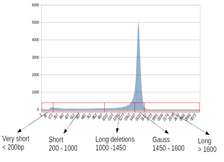

# CuReSim-LoRM: a tool to simulate metabarcoding long reads

CuReSim-LoRM (Customized Read Simulator to generate Long Reads for Metabarcoding) is a tool which generates
synthetic long sequencing reads for metabarcoding. 

A complementary script, train_CuReSim-LoRM.py, is available to train a new error model from real data.
This script was developed to automate the whole process, computing the parameters and running CuReSim-LoRM.

# Table of Contents
* [Installation](#Installation)
* [Usage](#Usage)
* [Methods](#Methods)
* [Training error models](#Training-error-models)
* [External tools](#External-tools)
* [Available profiles](#Available-profiles)
* [Support](#Support)
* [Citation](#Citation)

# Installation

CuReSim-LoRM is developed in Java and is distributed as an
executable jar file. It does not need installation step but require Java installed on your machine
(see http://www.oracle.com/us/technologies/java/overview/index.html for more details on Java).

To run CuReSim-LoRM, use the following command line :

```java -jar CuReSim-LoRM.jar [options] -f <input_file> [options]```

For big datasets you can use the ”java -XmxYYg” argument to allocate more memory to CuReSim-LoRM (e.g. -Xmx20g to
allocate 20Gb of RAM).

# Methods 
## Simulation of the error model
Form error-prone reads, CuReSim-LoRM first introduces deletions and insertions in reads with an iterative algorithm
that mostly introduces indels in the longer homopolymers. Then, substitutions are uniformly drawn. The error
rate follows an exponentiated weibull distribution with, by default, 28% of insertions, 42% of deletions and 30% of
substitutions.
The error rate is encoded in a profile file in CuReSim-LoRM.

```
read;ins;del;sub
1;0.0547;0.082;0.0586
2;0.0274;0.0411;0.0294
3;0.0292;0.0439;0.0313
```

The profile file is a text file containing 4 columns separated by semi colon ( ;) and n lines corresponding to the
number of reads to simulate. The first colum gives the unique ID, the second the rate of insertion to be introduced,
the third gives the rate of deletions and the last one gives the rate of substitutions. 
A **custom error profile** can be given by the user with the option **− p**.

## Simulation of the read length distribution
Once errors were introduced, CuReSim-LoRM simulates the read lengths. Six categories of length have been defined
in CuReSim-LoRM :


<p align="center">
  
</p>


1. the Gauss category : read length from 1,450 to 1,600 bp and following a Gaussian distribution with a mean of
1,500 bp and a standard deviation of 30
2. the long read category : reads with length greater than 1,600 bp
3. the very short reads category : read length lower than 200 bp
4. the short read category : reads with length comprised between 200 bp and 1,000 bp
5. the long deletion category : length between 1,000 and 1,450 bp, reads containing long deletions (several dozens or hundreds of
bases) leading to read lengths comprised between 1,000 and 1,450 bases. In CuReSim-LoRM, the size of these
long deletions follows an exponential distribution.
6. the second Gauss category : read length forming a second Gaussian distribution with a mean of 1,100 bp and
a standard deviation of 30 observed in some sequencing runs.


CuReSim-LoRM simulates the read lengths from the percentage of these six categories, by default, 67% of Gauss
category, 2% of very short reads, 9% of short reads, 21% of long deletion category, 1% of long reads and no second
Gauss category. The length parameter is encoded by a list of six integers:
**[gauss, longDel, longRead, short, veryShort,secondGauss]** and can be changed with option **− para**.


At the end of the simulation, CuReSim-LoRM outputs a FASTQ file with a fixed phred score quality value, by
default equal to 8 (**can be tuned with option − q**) , containing reads showing an ONT metabarcoding profile.

# Usage

## Command line and parameters

```
java -jar CuReSim-LoRM.jar [options] -f <input_file> [options]
-f file_name 	 [mandatory] reads fastq file (without errors, can be obtained from Grinder)
-o file_name 	 [facultative] name of output fastq file [output.fastq]
-r int 	 [facultative] number of random reads [0]
-q char 	 [facultative] quality encoding character [')']
-p file_name 	 [facultative] error profile
-para int[6] 	 read length parameters
-h 	 print this help
```
## Example of use

You can download test file containing error-prone reads coming from the ZymoBIOMICS mock community:
- [reads_test.fastq](reads_test.fastq) contains 5,000 reads
- [reads_test_20K.zip](reads_test_20K.zip) (unzip file before using) contains 20K reads

```
# Generate 5,000 reads in output.fastq with default parameters 
java -jar CuReSim-LoRM.jar -f reads_test.fastq

# Generate 20K reads in TEST.fastq with 17.4% of errors (profile_run1) and read lengh parameter equal to [70,10,1,15,0,4]
java -jar CuReSim-LoRM.jar -f reads_test_20K.fastq -p profile_run1.txt -para 70,10,1,15,0,4 -o TEST.fastq
```
Around 20 seconds are required to generate 5K reads and 1,5 minute for 20K reads.


# Training error models
The python script, train_CuReSim-LoRM.py, was developed to automate the whole process, computing the parameters and running CuReSim-LoRM.


The script train_CuReSim-LoRM requires several files in input. 


```
usage: train_CuReSim-LoRM.py [-h] [-o OUTPUT] grinder reads sam bbmap

positional arguments:
  grinder               grinder simulated reads in FASTQ format
  reads                 real reads in FASTQ format
  sam                   sam file of real reads
  bbmap                 distribution of identity obtained with bbmap

optional arguments:
  -h, --help            show this help message and exit
  -o OUTPUT, --output OUTPUT
                        output directoty [RESULTS]
```

1. grinder : the FASTQ file containing the error-prone simulated reads, can be obtained with grinder (see next section for more details)
2. reads : real reads in FASTQ format
3. sam: alignment file of real reads mapped against the reference sequences, for example with minimap2 (see next section for more details)
4. bbmap : identity percentage histogram from the real data which can be obtained with bbmap (see next section for more details about using bbmap)

The **-o** parameter can be used for the name of the output directory

train_CuReSim-LoRM.py produces several files:
1. curesim_reads.fastq: the file containing the simulated reads
2. OUTPUT_ERRORS.txt: the profile file that can be passed to CuReSim-LoRM
3. error_model.pdf: a plot showing the fitting of the error model with the real data
4. log.txt: the CuReSim-LoRM log file containing data on the simulation process (
5. log_error_profile.txt: a file containing the estimated parameters for CuReSim-LoRM (percentages of insertions, deletions and substitutions, 
```
nb simualted reads88820
INS 0.28
DEL 0.42
SUB 0.3
Estimation: 179.88921236201946,0.6423259882548946,-1.2151904273915284,0.9367877995036392
GAUSS: 338220,67.644%: 68
LONG: 2395,0.479%: 0
VERY SHORT: 9573,1.9146%: 2
SHORT: 44577,8.9154%: 9
1000-1450: 103479,20.695800000000002%: 21
############67,21,1,9,2,0
```

# External tools
## Grinder

You can use Grinder (https://github.com/zyxue/biogrinder) to generate reads without errors.
We advise to use these parameters:

```grinder -af proportions.txt -rf referenceSequences.fasta -tr numberOfreads -fr primers.fasta -lb 0 -cb 1 -rd 2000```

where *proportions.txt* contains the relative abundance of the reference sequences and *primers.fasta*  contains the sequence of the primers for the *in silico* PCR.
The option -lb=0 was used to have no length-bias, -cb=0 to have no copy bias and -rd=2000 to not truncate the read with a value greater than the length of the 16S gene.

## minimap2

To obtain the alignment SAM file of real reads against the reference sequences, we advise to use minimap2 (https://github.com/lh3/minimap2) 
with ONT sequencing model (-ax map-ont).

## bbmap

In ordre to obtain the identity histogram, we recommend were to use bbmap (https://jgi.doe.gov/data-and-tools/software-tools/bbtools/bb-tools-user-guide/bbmap-guide/) with a number of bins equal to 1,000. 
```
reformat.sh -in=alignment.sam idhist=output_distrib.txt idbins=1000
```

# Available profiles

| profile  | error rate (%)| insertions (%) | deletions (%) | subtitutions |
| ------------- | ------------- | ------------- | ------------- | ------------- |
| [run1](profiles/profile_run1.txt) | 17.4  | 12 | 58 | 30 |
| [run2](profiles/profile_run2.txt)  | 16.45  | 22 | 44 | 34 |
| [run3](profiles/profile_run3.txt) | 14.35| 28 | 42 | 30 |
| [newLot](profiles/profile_newLot.txt)| 14.5 | 28 | 42 | 30 |
| [newBasecalling](profiles/profile_newBasecalling.txt) | 11.2| 32 | 35 | 33 |
| [Urban](profiles/profile_urban.txt)| 10.6 | 24| 39 | 37 |


# Support
For questions and comments, please contact us at segolene.caboche(AT)univ-lille.fr.

# Citation

A manuscript describing CuReSim-LoRM is under publication. If you make use of the CuReSim-LoRM, please cite us: Caboche et al., CuReSim-LoRM: a tool to simulate metabarcoding long reads (submited).
