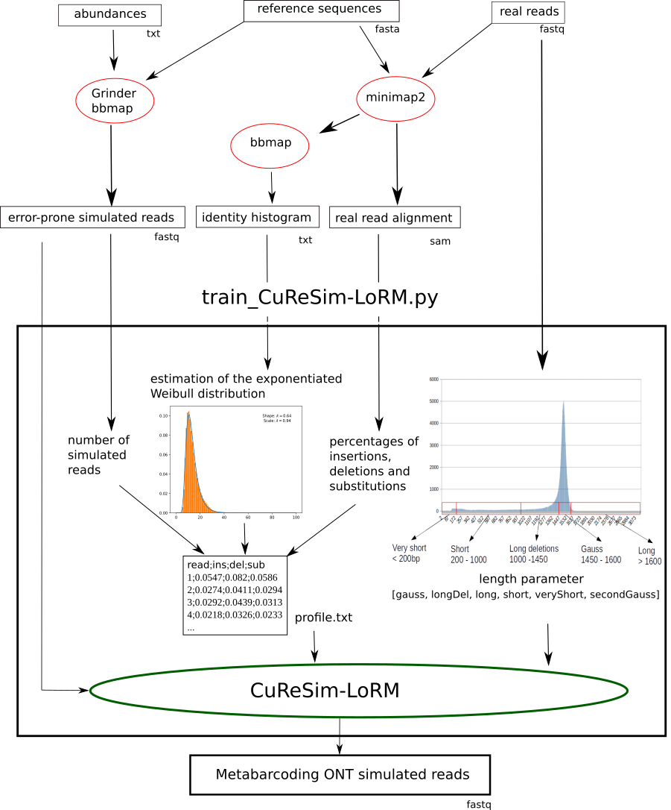

# CuReSim-LoRM: a tool to simulate metabarcoding long reads

CuReSim-LoRM (Customized Read Simulator to generate Long Reads for Metabarcoding) is a tool which generates
synthetic long sequencing reads for metabarcoding. 

A complementary script, train_CuReSim-LoRM.py, is available to train a new error model from real data.
This script was developed to automate the whole process, computing the parameters and running CuReSim-LoRM.

# Table of Contents
* [Installation](#Installation)
* [Usage](#Usage)
* [Methods](#Methods)
* [Training error models](#Learning-error-models)
* [External tools](#External-tools)
* [Support](#support)
* [Citation](#citation)

# Installation

CuReSim-LoRM is developed in Java and is distributed as an
executable jar file. It does not need installation step but require Java installed on your machine
(see http://www.oracle.com/us/technologies/java/overview/index.html for more details on Java).

To run CuReSim-LoRM, use the following command line :

```java -jar CuReSim-LoRM.jar [options] -f <input_file> [options]```

For big datasets you can use the ”java -XmxYYg” argument to allocate more memory to CuReSim-LoRM (e.g. -Xmx20g to
allocate 20Gb of RAM).

# Usage
```
Usage: java -jar simulator.jar [options] -f <input_file> [options]
-f file_name 	 [mandatory] reads fastq file (without errors, can be obtained from Grinder)
-o file_name 	 [facultative] name of output fastq file [output.fastq]
-r int 	 [facultative] number of random reads [0]
-q char 	 [facultative] quality encoding character [')']
-p file_name 	 [facultative] error profile
-para int[6] 	 read length parameters
-h 	 print this help
```

# Methods 
see pdf

# Training error models
The python script, train_CuReSim-LoRM.py, was developed to automate the whole process, computing the parameters and running CuReSim-LoRM.



The script train_CuReSim-LoRM requires several files in input. 
The FASTQ file containing the error-prone simulated reads, obtained from reference sequences and abundances, is used to get n the number of simulated reads and as direct input of CuReSim-LoRM. Real reads have to be mapped against the reference sequences, for example with minimap2, to obtain a SAM alignment file, which can be used with bbmap 15 to get an identity percentage histogram from the real data. 

# External tools
## Grinder

You can use Grinder to generate reads without error
```sudo time grinder -af proportions_V1.txt -rf Zymo_bacterialGenomes.fasta -tr 88820 -fr primers.fasta -lb 0 -cb 1 -rd 2000```

## minimap2

## bbmap


# Support
For questions and comments, please contact us at segolene.caboche(AT)univ-lille.fr.

# Citation

A manuscript describing CuReSim-LoRM is under publication. If you make use of the CuReSim-LoRM, please cite us: Caboche et al., CuReSim-LoRM: a tool to simulate metabarcoding long reads (submited).
